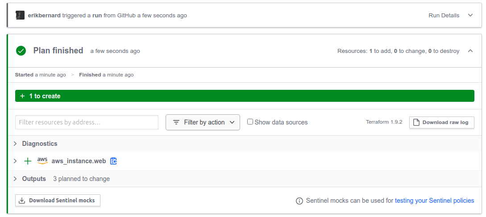
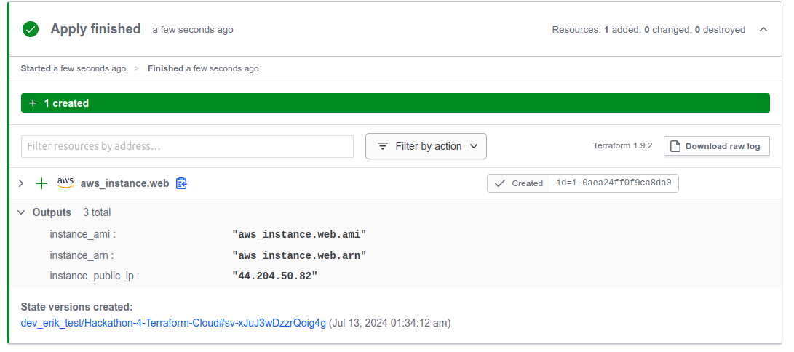
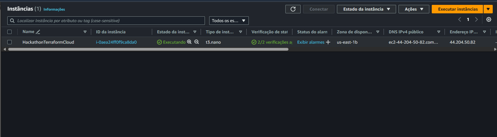

# Documentação do Projeto Terraform Cloud

Este documento oferece uma visão detalhada das etapas de execução do Terraform Cloud para provisionamento e gerenciamento de recursos. Cada passo é documentado com capturas de tela para fornecer uma referência visual completa do processo.

## Terraform Cloud

### Configuração do Workspace

A imagem a seguir mostra a configuração inicial do workspace no Terraform Cloud, onde o ambiente é preparado para os próximos comandos de provisionamento.

### Execução do Plano no Terraform Cloud

Esta captura de tela documenta a execução do plano no Terraform Cloud, detalhando as ações que o Terraform pretende realizar, similar à execução local mas com recursos adicionais de colaboração e log.

### Aplicação e Confirmação do Plano

A imagem abaixo mostra a fase de aplicação do plano no Terraform Cloud, onde os recursos são efetivamente criados. Inclui também uma visualização da aprovação e verificação do plano, garantindo que tudo ocorra como esperado.

### Verificação de Status e Logs

Esta captura de tela exibe o status final dos recursos provisionados, juntamente com os logs de execução, proporcionando uma verificação clara da execução correta no Terraform Cloud.

## Conclusão

As capturas de tela acima documentam o processo completo de utilização do Terraform Cloud para o provisionamento e gerenciamento de recursos. As imagens fornecem uma visão clara e detalhada de cada etapa, desde a configuração até a verificação final, garantindo que tudo está configurado e funcionando corretamente.